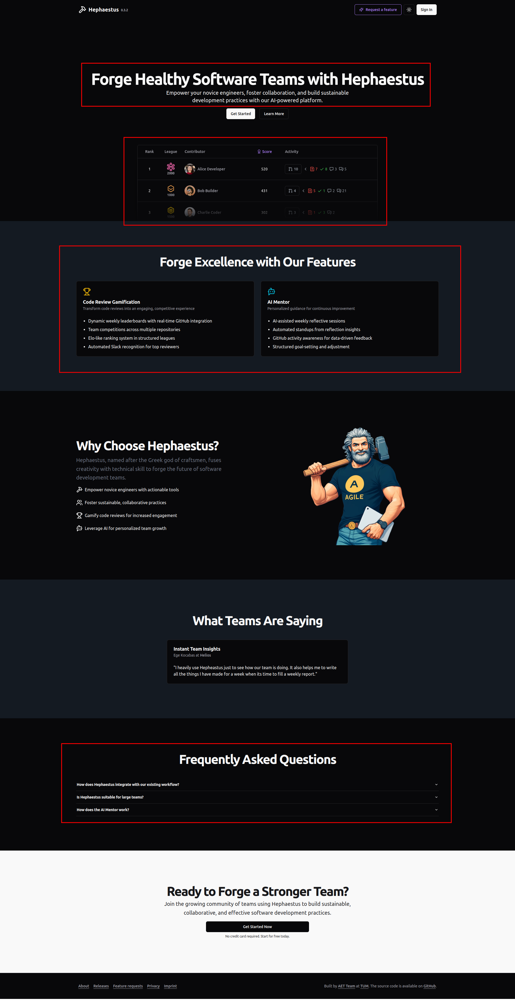
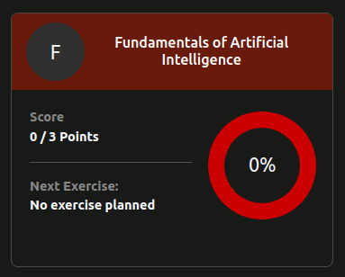
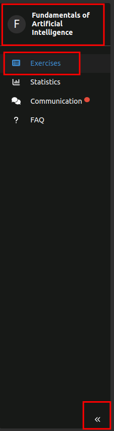
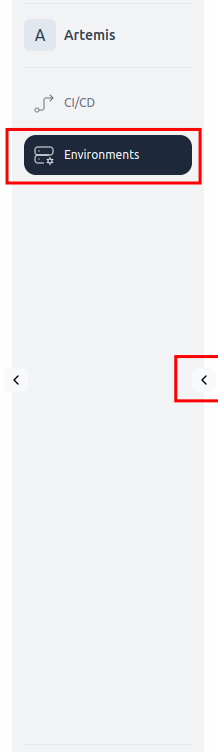
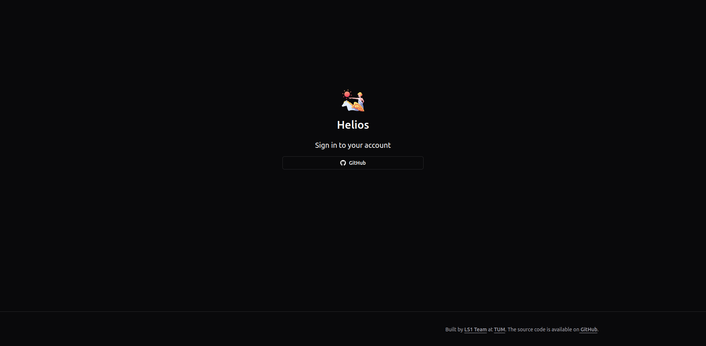
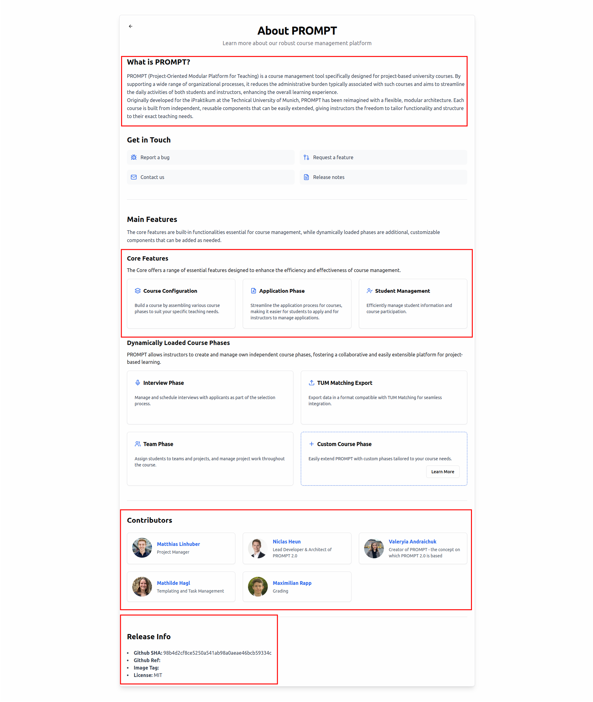

# 🎨 UI Design Recommendation for AET Web Apps  

## 🎯 Why is this Important?  

- 🧭 **Easier Navigation** – Users can quickly find what they need without confusion.  
- 🔍 **Instant Recognition** – A consistent design helps users immediately recognize they are on an AET platform.  
- ⚡ **Improved Efficiency** – Familiar layouts and interactions reduce cognitive load, making tasks faster and more intuitive.  
- 🎯 **Professional & Trustworthy** – A polished, cohesive UI reinforces credibility and trust in our applications.  
- 📱 **Seamless Multi-App Experience** – Users moving between AET apps experience a unified interface, reducing friction.  

By following these guidelines, we create a **seamless and enjoyable experience** for all users. 🚀  

## 🏠 Landing Page  
- **Features & FAQs** should be prominently displayed to help new users understand what the app is used for 
- The **Login button** should be highly visible for quick access.  
- **Most features** should be accessible **before requiring login** (avoid an early login wall).  

Example

## Header Design  
- Should include (in this order):
    - **App Name with Version Number**
    - **Dark Mode Toggle 🌙/☀️**
    - **Login Button**
- Should be max. **3.75rem in height**.  
- Should make use of the **primary color theme**.

Example

## Footer Design  
- Should include:  
  - **"Built by"** attribution 👨‍💻  
  - **About & Legal pages** 📜  
  - **Bug report / feature request link** 🐞 
- **Non-sticky**: The footer should **not** remain fixed while scrolling.  

Example

 

## 📂 Project/Course Page  
- **Projects/Courses should be displayed as cards** instead of a list for better **visual clarity**. The cards should include the **title of the project/course** as well as **most relevant information about the project/course**
- **No sidebar** should be used on the **main project/course page**.  

Example

 

## ⏩ Sidebar Navigation  
- **Project context** should be displayed at the **top** of the sidebar, which can be used to quickly switch projects.
- The other items should only be **used for switching different in-project contexts** but **not for switching between projects**.
- **Project settings** should be placed **at the bottom** of the sidebar with a divider above.  
- Items in the sidebar should contain a **icon** and a **short text**
- Sidebar should be **collapsible & expandable** via a **prominent chevron icon**.
- Should make use of the **primary color theme** or be at least visually highlighted.
- On mobile devices:
    - there should be a **sidebar icon or burger menu icon** on the far left of the header to expand the sidebar.
    - the sidebar should be hidden by default.

Example

 

## 🔐 Authentication  
- If **Keycloak** is used, the **Keycloakify theme** should be applied for a unified login experience for all AET apps. 

Example

 

## ℹ️ About Page  
- Should include:  
  - 📸 **Features with screenshots** for clarity.  
  - 🤝 **Contributor information**  to acknowledge contributions.  
  - 🛠️ **Developer details** such as **version number, GitHub SHA** etc..  

Thanks for following these recommendations, with that we ensure a **modern, accessible, and user-friendly** experience for AET web applications! 🚀  

Example

 

## Color Theme
As primary colors, please use the following color gradiations:
- 100: `#D7E4F4` 
- 200: `#C2D7EF`
- 300: `#9ABCE4`
- 400: `#5E94D4`
- 500 (primary color): `#3070B3`
- 600: `#14519A`
- 700: `#114584`
- 800: `#0E396E`
- 900: `#0A2D57`

# Further Ideas to Improve UI Design@AET
- Add keycloakify project for AET that is included by different projects
- Add boilerplate html code for Imprint etc.
- Add color theme for AET following the TUM theme
- Agree on a single icon library for all projects (e.g. tabler)

